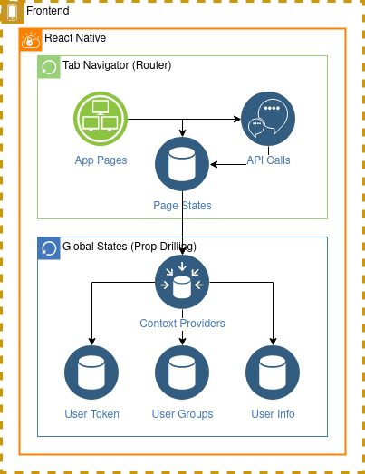

# Canyon Frontend Mobile App

The official Canyon app for a seamless communication experience, utilizing our backend with efficient state management to provide a minimal latency experience.

**Note: since our EC2 instance and domain have been taken down due to cost reasons, you will need to refactor the frontend code to make requests to your backend instance and not `joincanyon.org/`!**

## Documentation

For a general overview, see the [broad overview](#broad-overview) section; if you'd like to get into the weeds, see the [technical details](#technical-details) section.

### Architecture Diagram

### Broad Overview

Our frontend is a simple React Native app with five main screens: a login/signup screen, a home screen displaying a user's groups, an answer screen to answer questions, a responses screen to view previous responses, and a profile screen to edit personal information.

The home page allows users to also scroll through individual groups, create new questions, view group members, and view previous question responses, and the answers page allows users to answer new questions and edit still-open questions.

### Technical Details

Our project is split into the following structure:

- `src/`
  - `components/`
    - Provides shared components used across screens.
  - `screens/`
    - Provides the various screens of our app, served from `App.js`. Equivalent to React JS' `pages/` directory.
  - `store/`
    - Stores the context and state definitions for our global states.
  - `styles/`
    - Stores shared styles in addition to base styles for each screen to increase modularity
- Base App.js file is located outside the `src/` directory and contains the "entry point" of the frontend.

Some notable components and technologies are as follows:

**Groups.js**

- Component that holds all the group information of a specified group. Utilizes Interval for the timer functionality, calculated from UTC time as our EC2 instance is in UTC time. By using JavaScript `map()` functions paired with ternary operators on states `state ? <View /> : null`, our code remains very linear despite a non-linear interface with pop-up modals.

_OnClick_

- Data is fetched
- Abilitly to:
  - Create a new issue with our selectQuestion.js component
  - View previous responses with our Question.js component

**ResponsesPage.js and AnswerPage.js**

- Using our Question.js component as well

**Share Component**

- Share component from react-native allows us to send messages in native IOS and Android environments

**Contexts**

The most unintuitive thing about our application is our state management system. As the project is small, Redux was overkill. Instead, the frontend uses prop-drilling to pass a global state through the various screens and components.

On login, the home page does an initial fetch using the user's token of all the groups the user is in and stores it in a state called groups. This state is accessed in almost all other screens. When viewing a specific response or issue or some other attribute of a group, instead of calling an endpoint on our backend, the app instead utilizes helper methods within `store/info.js` to search for relevant information.

Likewise, updates/new information posted to the backend are received in a successful response message and directly replaced/added to the groups object, before updating the state to trigger a rerender across pages and components. Because of the smart usage of states, our app makes minimal calls to our rate-limited EC2 instance to reduce network costs and minimize application latency by eliminating the majority of redundant network calls.

What this implies to you, as a contributor, is that you need to utilize the groups, auth, and self context using `useContext()` and the specified context `InfoContext`, `AuthContext`, and `SelfContext` respectively in order to integrate seemlessly into existing pages. Either way, make sure to update the groups state in order to trigger rerenders for new information.

With all this, you are also ready to begin contributing to the frontend. Review React if you aren't familiar with states and hooks, minimize the amount of calls to the backend, and you will be ok. Happy coding!

## Testing

**This guide assumes that you have followed the initial setup guide in the main README at the project's base path.**

Navigate to the `frontend/` directory and install the following if not already installed:

- npm
- npx
- expo (via npx)

Once those are installed, run `npm i` to install dependencies and `npx expo start` to start the app. No other secrets are necessary, and by scanning the QR code with the Expo Go app installed, you can begin testing the app, which auto-reloads on saved files. Make sure to be connected on the same network as the device hosting the expo app.

## Color Palette

App Colors (see `src/styles/colors.js`)

-  `#121418` - Background
-  `#ffffff/white` - Primary Text/Element
-  `#d3d3d3/lightgray` - Secondary Text
-  `#000000/black` - Primary Contrast Text

Brand colors

-  `#feffbe` - Background
-  `#ffb77a` - Accent 1
-  `#fc9e4f` - Accent 2
-  `#ff8a00` - Orange
-  `#eb5e28` - Dark 1
-  `#9a3d2c` - Dark 2
